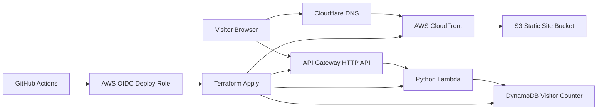

# Cloud Resume Challenge

Production-style cloud portfolio project showing how I build and operate a small serverless application with Terraform, GitHub Actions, OIDC, Astro, and AWS.

Live site: [atoumbre.me](https://atoumbre.me)

## What This Repository Demonstrates

- Infrastructure as Code with reusable Terraform modules
- Serverless backend design with Lambda, API Gateway, and DynamoDB
- Edge delivery with S3, CloudFront, and Cloudflare-managed DNS
- GitHub Actions deployment using OIDC instead of long-lived AWS keys
- A static Astro frontend that consumes a live backend API at build/runtime boundaries

## Architecture



## Repository Structure

```text
cloud_resume_challenge/
├── frontend/                    # Astro frontend
├── backend/                     # Lambda handler and backend tests
├── infra/
│   ├── main.tf                  # Root Terraform composition
│   ├── variables.tf             # Root input variables
│   ├── outputs.tf               # Deployment outputs
│   └── modules/
│       ├── backend_api/         # Lambda, HTTP API, and DynamoDB resources
│       ├── oidc/                # GitHub Actions OIDC provider and deploy role
│       └── s3_cloudfront/       # S3 origin, CloudFront distribution, ACM, DNS
└── deploy_local.py              # Optional local deploy helper aligned to Astro
```

## Deployment

The primary deployment path is GitHub Actions via [`.github/workflows/deploy.yml`](./.github/workflows/deploy.yml). A push to `main` can apply Terraform, run backend tests, build the Astro frontend, publish the site to S3, and invalidate CloudFront.

### CI/CD flow

1. GitHub Actions assumes an AWS role using OIDC.
2. Terraform applies infrastructure from [`infra/`](./infra).
3. Backend tests run from [`backend/test_app.py`](./backend/test_app.py).
4. The frontend builds with `PUBLIC_API_URL` set from Terraform outputs.
5. The generated `frontend/dist/` assets are synced to S3 and CloudFront is invalidated.

### Optional local deploy helper

[`deploy_local.py`](./deploy_local.py) is an optional helper for manual deployment. It follows the same high-level flow as CI: Terraform apply, Astro build, S3 sync, CloudFront invalidation.

Run it from the repo root:

```bash
python3 deploy_local.py
```

## Local Setup

### Prerequisites

- AWS CLI
- Terraform `>= 1.5`
- Node.js `>= 22.12.0`
- Python `>= 3.12`

### Terraform variables

Commit `terraform.tfvars.example`, not live `terraform.tfvars`.

```bash
cp infra/terraform.tfvars.example infra/terraform.tfvars
export TF_VAR_cloudflare_api_token="YOUR_CLOUDFLARE_API_TOKEN"
```

The example file contains only non-secret defaults and repository-specific values.

## Testing

Current automated checks in this repository are lightweight but real:

- Backend unit tests with `pytest` and `moto`
- Production frontend build with Astro
- Deployment verification through Terraform outputs and the live site

Run the main checks locally:

```bash
(cd backend && python3 -m pip install pytest moto boto3 && pytest test_app.py)
(cd frontend && npm install && npm run build)
```

## Key Engineering Decisions

- Use OIDC for GitHub Actions to avoid storing long-lived AWS credentials in GitHub secrets.
- Keep the frontend static and let only the visitor counter use serverless compute.
- Provision the visitor counter table inside the `backend_api` Terraform module because the Lambda, API, and DynamoDB resources are tightly coupled.
- Use CloudFront in front of S3 rather than direct bucket hosting so the site can use a proper CDN, TLS, and controlled origin access.

## Security And Delivery Notes

- AWS access for CI is federated through the IAM role created by the `oidc` module.
- The S3 bucket is private and exposed through CloudFront origin access control.
- Cloudflare handles DNS while AWS serves the site and API.
- Terraform remains the source of truth for infrastructure state.

## Future Improvements

- Add `terraform fmt -check` and `terraform validate` to CI before `terraform apply`.
- Split CI and CD so pull requests get plan/build/test feedback without applying infrastructure.
- Add frontend smoke tests for the counter behavior against a deployed preview or local mock API.
- Narrow the GitHub Actions deploy role permissions further as the infrastructure stabilizes.
