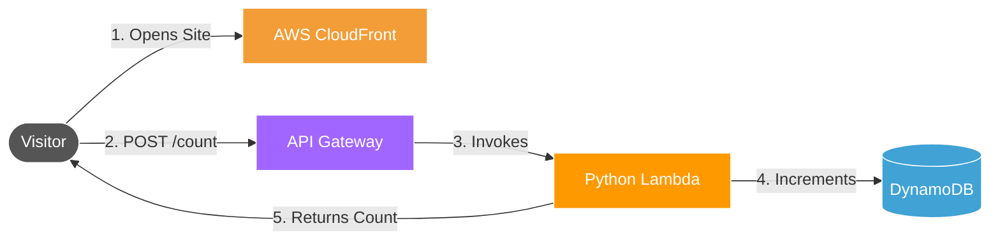

# ☁️ Cloud Resume Challenge

This repository contains my implementation of the **Cloud Resume Challenge**: a production-style cloud project designed to demonstrate practical skills in **serverless architecture**, **Infrastructure as Code**, **secure CI/CD**, and **modern frontend delivery**.

The application is a live interactive resume available at **[atoumbre.me](https://atoumbre.me)**. It combines a static frontend, a serverless AWS backend, managed persistence, and automated deployment workflows.

---

## Why this project matters

This project was built to demonstrate hands-on ability to:

- design and deploy a **serverless application** on AWS
- provision infrastructure using **Terraform**
- implement **secure CI/CD** with GitHub Actions and OIDC
- integrate a static frontend with a dynamic backend API
- manage cloud resources using repeatable, production-minded practices
- deliver content globally through **CloudFront**

Rather than being a simple static resume page, this project shows how I approach **cloud infrastructure, automation, security, and deployment discipline**.

---

## Live Site

[atoumbre.me](https://atoumbre.me)

---

## Architecture Summary

The solution uses a static frontend delivered at the edge and a lightweight serverless backend on AWS.

| Layer | Technologies | Role |
| :--- | :--- | :--- |
| **Frontend** | Astro, Tailwind CSS, DaisyUI | Builds a fast, modern, static resume website |
| **Edge Delivery** | AWS CloudFront, Cloudflare | Global content delivery, caching, DNS, and SSL |
| **Backend API** | AWS Lambda, API Gateway, Python | Handles visitor counter requests through a serverless endpoint |
| **Database** | DynamoDB | Stores and updates visitor count data |
| **Infrastructure as Code** | Terraform | Provisions and manages infrastructure declaratively |
| **CI/CD** | GitHub Actions | Automates validation and deployment workflows |

---

## What this project demonstrates

This project highlights several capabilities relevant to **Cloud Engineer**, **DevOps Engineer**, **Platform Engineer**, and **Infrastructure-focused backend** roles.

### 1. Serverless design
The backend uses **API Gateway**, **Lambda**, and **DynamoDB** to implement a simple but realistic dynamic feature without maintaining servers.

### 2. Infrastructure as Code
Infrastructure is defined and managed with **Terraform**, making deployments repeatable, reviewable, and easier to evolve.

### 3. Secure delivery pipeline
The CI/CD pipeline is designed around **GitHub Actions** and **OIDC-based authentication**, avoiding long-lived cloud credentials in the repository.

### 4. Separation of concerns
The repository is organized into distinct frontend, backend, and infrastructure layers, reflecting a clean engineering structure and maintainable workflow.

### 5. Edge-first delivery
The static site is delivered through **CloudFront** and integrated with **Cloudflare** to improve performance, availability, and DNS management.

---

## Application Flow

When a visitor opens the site:



1. The frontend loads as a static site from the edge.
2. A request is sent to the serverless API.
3. API Gateway invokes a Python Lambda function.
4. The Lambda function reads and updates the visitor count in DynamoDB.
5. The updated count is returned to the frontend and displayed in real time.

This keeps the site fast and mostly static while still supporting live backend-driven functionality.

---

## Repository Structure

```text
cloud_resume_challenge/
├── frontend/                    # Astro frontend application
│   ├── src/pages/               # Site pages
│   └── src/styles/              # Global styles and Tailwind directives
├── backend/                     # AWS Lambda source code
│   ├── app.py                   # Visitor counter handler
│   └── test_app.py              # Backend tests
├── infra/                       # Terraform configuration
│   ├── modules/s3_cloudfront/   # Static hosting and CDN resources
│   ├── modules/apigw_lambda/    # API Gateway and Lambda resources
│   └── modules/dynamodb/        # DynamoDB resources
```

---

## Local Setup

### Prerequisites

* AWS CLI
* Terraform `>= 1.5`
* Node.js `>= 20`
* Python `>= 3.x`

### Environment configuration

Sensitive values should be stored locally and excluded from version control.

Example:

```bash
export TF_VAR_cloudflare_api_token="YOUR_CLOUDFLARE_API_TOKEN"
```

### Deployment

To deploy locally:

```bash
./deploy_local.sh
```

---

## Security and delivery practices

This project was built with secure deployment principles in mind:

* no long-lived AWS credentials stored in the repository
* GitHub Actions authenticates to AWS using **OpenID Connect**
* secrets are injected through environment variables
* infrastructure changes are managed through Terraform
* cloud resources are provisioned in a consistent and auditable way

---

## Why I built it

I used this project to demonstrate not just that I can provision cloud services, but that I can connect architecture, automation, and delivery into a coherent solution.

It reflects the way I think about engineering work: build lean, automate early, secure the pipeline, and keep the design maintainable.

